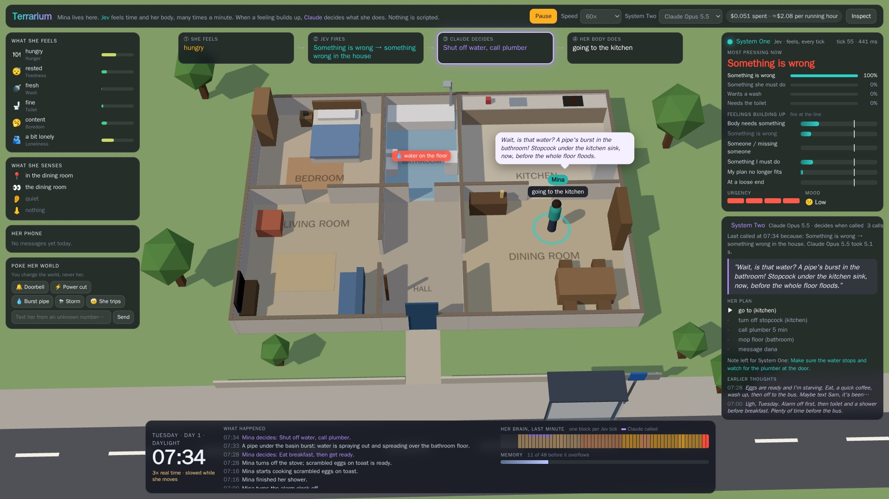
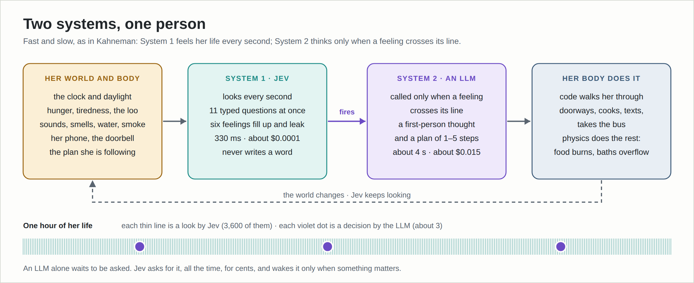
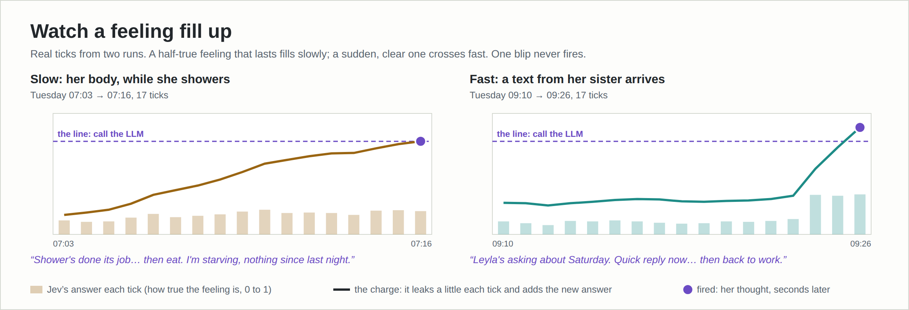
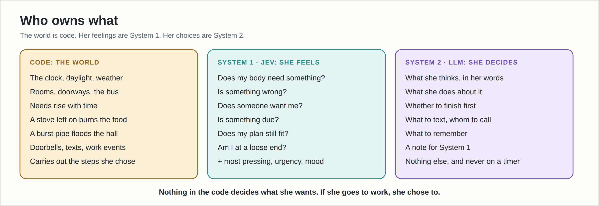
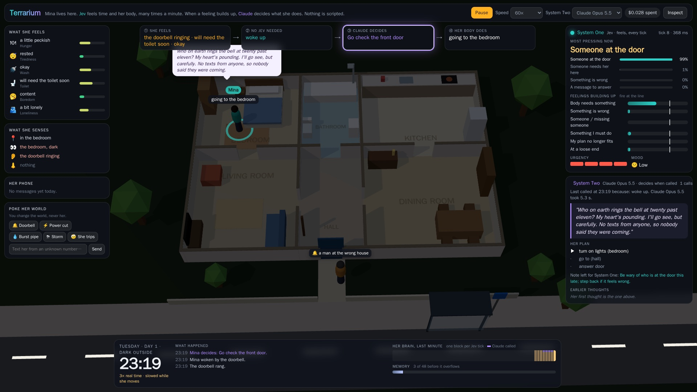
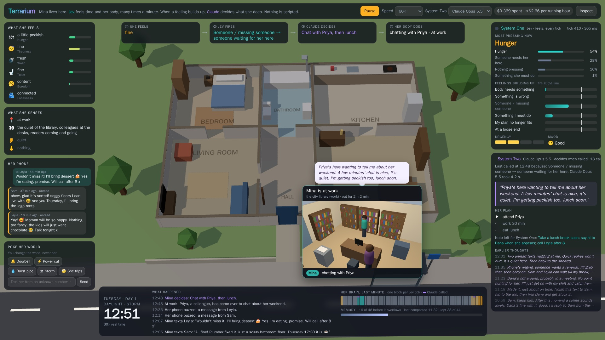
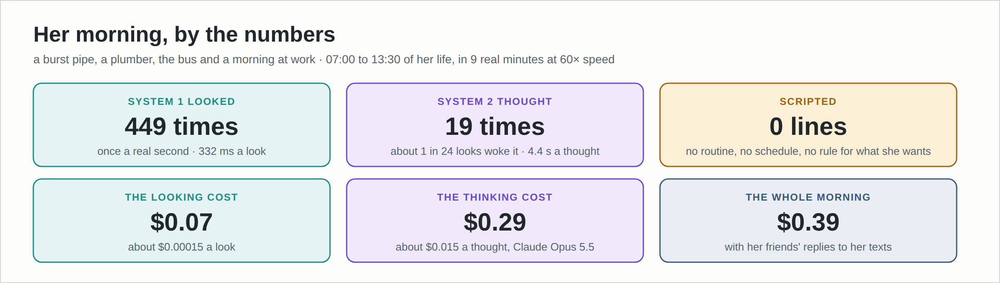

# Mina's Terrarium

**An artificial person who feels time pass.** Mina, 34, lives alone in a small house and works at the city library. Her life runs on two systems: **[TypeSafe Jev](https://docs.typesafe.ai)** feels her body, senses and the clock every second, and an **LLM** decides what she does, but only when a feeling crosses its line. Nothing about her day is scripted.



## Why

An LLM is smart, but it only thinks when someone asks. To run a home or an office it would have to be asked, every second, *"is there something to do here?"*. That is too slow and too expensive for an LLM.

A person is different. Time passes for us. Hunger builds, a sound catches our ear, we notice nobody has called. A fast, cheap part of the brain feels all of that, and only now and then do we stop and think.

**Jev is that fast part.** It answers typed questions in about 330 ms for a fraction of a cent, so it can look at her life every second. The LLM is the slow part. It is called only when something matters.



## How it works

- **Every second, System One (Jev) reads her state:** the clock, her body in words ("very hungry"), what she sees, hears and smells, her phone, her plan, her memory. It answers 11 typed questions in one request.
- **Six of them are feelings:** my body needs something, something is wrong, someone wants me, something is due, my plan no longer fits, I'm at a loose end. Each feeling fills a little each tick and leaks a little. A single blip never fires; a feeling that lasts does.
- **When a feeling crosses its line, System Two (an LLM) decides.** It returns her inner thought, a plan of 1–5 steps, and a note for System One to keep an eye on.
- **Code carries out the plan and runs the world:** rooms and doorways, the bus, needs that rise with time, a stove that burns food if she forgets it, a pipe that floods the hall.





## What you see

The page follows one line across the top: **① she feels → ② Jev fires → ③ the LLM decides → ④ her body does**. Her senses are on the left, her two systems on the right, and her story and clock are at the bottom.



When she goes out, a live window above the bus stop shows where she is: the bus, the library, the café, the shop, the park, her sister's flat. At work, ordinary things come up (a reader needs help, a colleague stops by, the desk phone rings), and her brain decides what to do about them.



You can **poke her world**, but never her: ring the doorbell, cut the power, burst a pipe, bring a storm, trip her up, or text her from an unknown number.

## By the numbers



## Run it

You need Docker (or Podman with `docker` aliased) and API keys for TypeSafe and Anthropic. Nothing is installed on your machine; everything runs in a container.

```bash
cp .env.example .env            # add TYPESAFE_API_KEY and ANTHROPIC_API_KEY (OPENAI_API_KEY is optional)
cd terrarium
docker compose up -d --build
open http://localhost:3006
```

- **She lives only while a page is open.** Close the page, or press **Pause** (Space), and everything stops: no API calls, no cost.
- **Time:** quiet stretches run at 60× (changeable). The world slows to 3× while she walks, 6× when something happens, and real time while she thinks, so a thought never costs her ten minutes.
- **System Two is switchable while she lives:** Claude Opus 5.5 (default), Claude Opus 5, Claude Haiku 4.5, or GPT-6 Luna.
- **Every run is logged** to `terrarium/logs/`: a plain-text story, every Jev tick, and every System Two prompt and answer.
- **Keys stay on the server.** They are never in the image or the browser.

Details, settings and the file map are in [terrarium/README.md](terrarium/README.md).

## What's in this repo

| Folder | What |
|---|---|
| [`terrarium/`](terrarium/) | The current build: server, world, brain, the 3D page. |
| [`fable/`](fable/) | The first build, kept for reference. |
| [`terrarium-brief.md`](terrarium-brief.md) | The brief both builds were made from. |
| [`docs/`](docs/) | The figures in this README and the script that draws them. |

## Honest limits

- **The LLM sometimes invents small facts** the world does not have: a spare key, a neighbour's name.
- **Other people are thin.** Her sister, her friend and her manager reply to texts and calls through the same LLM, and can visit. Nobody else has a brain.
- **System One needs tuning.** How fast a feeling fills, how long it rests after firing, and what counts as new decide whether she overthinks or misses things.
- **It is a simulation, not a mind.** The claim is narrower and, I think, more useful: an LLM reacts to events; with a ticking System One, it can react to nothing happening, and to time passing.

## Licence

MIT. See [LICENSE](LICENSE).
